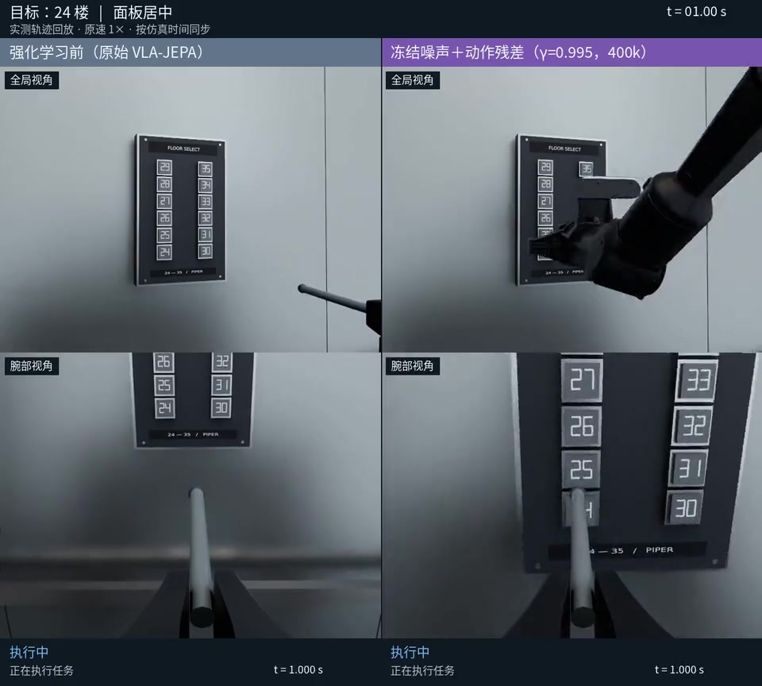
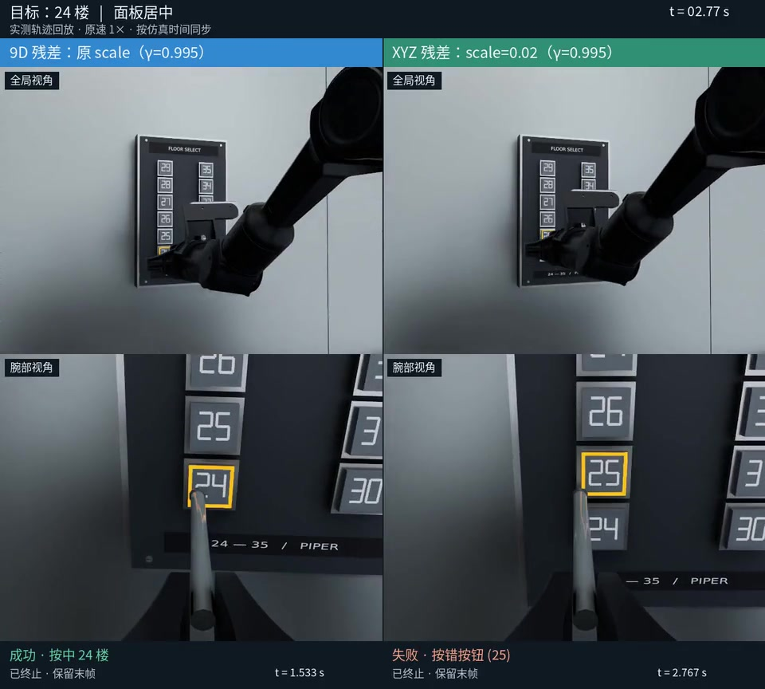
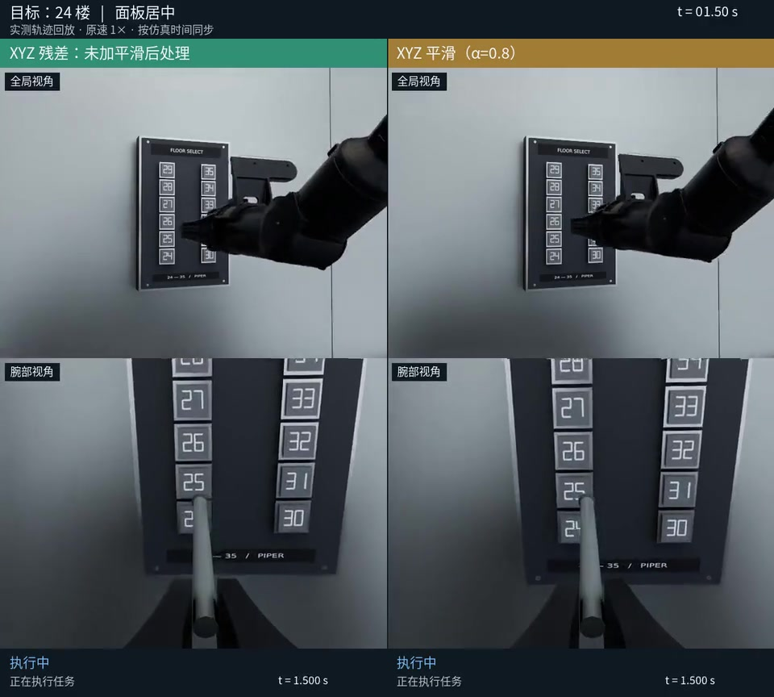
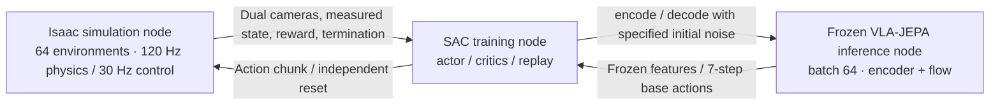

# PressB — PiPER Elevator Button Pressing and Online Residual RL for VLA

**English** | [简体中文](README.zh-CN.md)

**Progress update: 2026-10-09.** The three-node framework for parallel Isaac simulation, frozen VLA-JEPA inference, and SAC training is complete, along with 1M online training for each of two methods and several 400k runs that train action residuals from scratch over a fixed noise policy. The latest XYZ-only residual achieved **119/120 (99.17%)** in a single evaluation under fixed conditions. Additional action smoothing remains experimental and is disabled by default.

[Current results](#current-results) · [Demo videos](#demo-videos) · [Three-node framework](#online-reinforcement-learning-three-independent-nodes) · [Running the system](docs/online_rl_fast.md) · [Project handover](docs/HANDOVER.md)

The current RTX 5090 environment uses **Isaac Sim 5.0 / Isaac Lab 2.2 / Python 3.11**. The project includes trajectory planning, physical contact feedback, dual-camera recording, LeRobot export, action replay, closed-loop VLA evaluation, and online residual reinforcement learning. Historical scripts and documentation for Isaac Sim 4.5 / Isaac Lab 2.0.2 are retained.

- A black PiPER sits at the edge of a table, holding a pressing rod with a fixed total gripper opening of 8 mm. Its initial pose folds the upper arm and forearm above the tabletop.
- The wall-mounted panel has 2 columns × 6 rows: floors 24–29 run from bottom to top on the left, and 30–35 on the right. Contact force depresses each button; its orange edge light turns on when pressed and off when released.
- One D435 is mounted at the wrist and another on the table. The wrist mount reuses AgileX's official bracket mesh; both RGB streams default to 640×480.
- Data collection supports panel offsets of ±25 mm left/right and ±10 mm forward/backward, with stratified 10×10 coverage and 100 episodes per floor, totaling 1,200 episodes.
- Training data retains only the prefix from the folded initial pose to the first successful button light. Retraction and return motions prepare the next collection run and remain in the raw diagnostic records.

The repository includes code, configuration, asset source manifests, result summaries, and selected demos. **Full datasets, model weights, downloaded assets, Conda environments, and raw run recordings are not stored in Git**; only the compressed demos in [docs/media](docs/media/README.md) are distributed with the repository. See [scene_details.md](docs/scene_details.md) for scene details and historical validation records.

## Current results

The base VLA-JEPA was fine-tuned on 1,200 expert episodes with varied panel positions, using the fixed **step 10600** checkpoint. VLA remains frozen throughout the online stage. Action-output residuals and flow initial noise are first learned independently; the trained noise policy is then held fixed while a new action residual is trained from random initialization. The noise method directly selects the flow's initial noise without backpropagating into VLA.

The table reports a fixed-condition evaluation under the same fast simulation setup: **12 buttons × 5 panel positions (center and four corners) × 2 repeats = 120 trials**, with seed=20260930. Success requires actual button contact, and evaluation does not update parameters. The 400k budget applies to the newly trained action residual; the preceding 1M noise-policy training is separate. Repeated runs are not guaranteed to be bitwise identical, and a single result does not establish generalization across seeds.

| Method | Online training | Successful trials | Success rate |
|---|---|---:|---:|
| Base VLA-JEPA | No RL | 25/120 | 20.83% |
| Independent action residual | 1M | 81/120 | 67.50% |
| Independent initial-noise policy | 1M | 81/120 | 67.50% |
| Combination of the two independently trained policies | Two 1M checkpoints; no joint retraining | 96/120 | 80.00% |
| Fixed noise, retrained 9D residual, γ=0.99 | 400k | 114/120 | 95.00% |
| Fixed noise, retrained 9D residual, γ=0.995 | 400k | 118/120 | 98.33% |
| Previous configuration with residual scale halved | 400k | 87/120 | 72.50% |
| **Fixed noise, retrained XYZ residual, γ=0.995** | **400k** | **119/120** | **99.17%** |

The latest XYZ actor outputs only **7×3=21 residual dimensions**, with position scale **[0.02, 0.02, 0.02] m**; rotation and gripper commands retain the frozen model's outputs. The 400k run took approximately **7 hours 25 minutes** and completed 398k SAC updates. Button 24 succeeded in 9/10 trials, and buttons 25–35 each succeeded in 10/10. The full 9D comparison uses scales of 0.03 m per XYZ component and 0.1 per rotation6D component; the half-scale setting uses 0.015 m per XYZ component and 0.05 per rotation6D component. The discount γ applies to each 30 Hz control step, giving `γ**7` for a 7-step chunk.

**Smoothing experiments (1,320 evaluations completed):** XYZ exponential smoothing with α=0.8 reduced median measured joint jerk by about 14% and end-effector position jerk by about 30% on tasks that succeeded in both conditions, while increasing task duration by about 0.7%–2.7%. It achieved 119/120 during screening (concurrent baseline: 117) and 117/120 in an independent-seed check (baseline: 116). Position-plus-orientation smoothing and the lighter α=0.9 setting also failed to meet all predefined success-rate thresholds. The default therefore remains **no additional postprocessing**; the best screening result for a smoothing candidate is not treated as a stable finding.

Downloadable [results and per-button statistics](docs/results/online_rl_20261009.json) and the [CSV results table](docs/results/online_rl_20261009.csv) retain source log references and SHA-256 hashes. The [smoothing summary](docs/results/smoothing_20261009.csv) includes every candidate. See [residual training over frozen noise](docs/residual_on_frozen_noise.md) for reproduction instructions, freeze checks, and experiment configurations.

## Demo videos

Click a preview to play or download the MP4. All three videos cover all 12 buttons in the center layout at **1× simulation time**, with the global view above the wrist view. A clearly labeled terminal freeze-frame appears when each task ends. These demo samples differ from the 120-trial evaluation above, which includes panel offsets.

| Base VLA → fixed noise + 9D residual | 9D residual → XYZ-only residual | XYZ smoothing experiment (not adopted) |
|---|---|---|
| [](https://github.com/pgq18/PressB/raw/refs/heads/main/docs/media/before-vs-residual.mp4) | [](https://github.com/pgq18/PressB/raw/refs/heads/main/docs/media/pose9-vs-xyz.mp4) | [](https://github.com/pgq18/PressB/raw/refs/heads/main/docs/media/xyz-smoothing-experimental.mp4) |
| Left: 4/12; right: 12/12. Right uses γ=0.995 and 400k training. | Left: 12/12; right: 11/12. The XYZ demo includes one 24→25 wrong press. | Both sides: 12/12. The full concurrent evaluations scored 116/120 and 117/120. |

See the [media notes](docs/media/README.md) for original video sources, compression settings, actual frame counts, and audit records. Video smoothness reflects replayed measured trajectories; playback acceleration and frame interpolation are not used to create differences.

## Repository roles and reproduction scope

| Repository | Role | Local location |
|---|---|---|
| [PressB](https://github.com/pgq18/PressB) | Isaac scene, three-node services, SAC integration, experiments, evaluation, and video audits | This repository; RL code is in `src/pressb/online_rl/` |
| [VLA-JEPA](https://github.com/pgq18/VLA-JEPA/tree/base) | Vision/state/language encoders, flow-matching model, and PiPER fine-tuning and inference | Separate repository at `src/VLA-JEPA/` |
| [ZPRL-PressB](https://github.com/pgq18/ZPRL-PressB) | Reference implementation for residual SAC, initial-noise methods, and sampling schedules | Optional separate repository at `src/ZPRL/`; PressB does not need to import it |

These two subdirectories are independent Git repositories, excluded from the PressB package and not implicit submodules. Their versions and roles are recorded in the [repository lock file](repos.lock.json). Trained RL checkpoints are strictly tied to their inference source. To reproduce existing weights, keep the VLA-JEPA runtime checkout at `9c9dc71c8e199c7428b25d103ab666395832c001`; a documentation-only update must not move it to the latest HEAD:

```bash
git clone --branch base https://github.com/pgq18/VLA-JEPA.git src/VLA-JEPA
git -C src/VLA-JEPA checkout --detach 9c9dc71c8e199c7428b25d103ab666395832c001

# Optional: inspect the original RL methods. The training code is already in PressB.
git clone https://github.com/pgq18/ZPRL-PressB.git src/ZPRL
```

A clean clone includes source code, selected media, and statistical summaries. It **does not include** VLA/RL weights, scene snapshots, collection metadata, or model caches. The three general-purpose nodes accept explicit paths. In contrast, `run_residual_on_noise_experiment.py` and the smoothing and video experiment supervisors are reproduction entry points for this workspace: they depend on the existing `outputs/` assets and identity manifests documented here and cannot run directly in an empty directory. See the [high-throughput run guide](docs/online_rl_fast.md) and [5090 environment guide](docs/rtx5090_setup.md) for deployment.

## Installation

**RTX 5090 workstation:** Use the validated Python 3.11 / Isaac Sim 5.0 / Isaac Lab 2.2 configuration, installed through `scripts/setup_env_5090.sh`. See the [RTX 5090 run guide](docs/rtx5090_setup.md) for steps and measured results. The legacy `scripts/setup_env.sh` targets the original Python 3.10 configuration.

Requirements: Linux x86_64, Conda, an Isaac Sim-compatible NVIDIA RTX GPU and driver, Vulkan, and system installations of `git`, `ffmpeg`, `ffprobe` (FFmpeg must include `libx264`), and DejaVu fonts. Headless runs still require GPU rendering. VRAM requirements increase with the number of parallel environments; start by validating one environment on one GPU.

```bash
git clone https://github.com/pgq18/PressB.git
cd PressB

# Ubuntu / Debian system dependencies; install as needed on your machine
sudo apt-get install ffmpeg fonts-dejavu-core

# Current 5090 Isaac environment: Python 3.11, default path .conda/envs/pressb
# Set CONDA_BIN=/path/to/conda to select Conda explicitly
bash scripts/setup_env_5090.sh

# Download pinned assets and verify SHA-256; conflicting files are not overwritten
.conda/envs/pressb/bin/python scripts/fetch_assets.py

# Extract the official bracket and D435 meshes unchanged using isolated OpenUSD 24.11
PYTHONPATH=.cache/usd-inspect .conda/envs/pressb/bin/python scripts/prepare_wrist_asset.py

# LeRobot conversion environment: separate Python 3.12 / CPU PyTorch
bash scripts/setup_dataset_env.sh
```

Keep the two Python environments separate: simulation uses `.conda/envs/pressb/bin/python`, while LeRobot conversion and the official reader use `.conda/envs/lerobot/bin/python`. Do not install `requirements-dataset.txt` into the Isaac environment. The setup script sets `OMNI_KIT_ACCEPT_EULA=YES`; NVIDIA software and assets remain subject to their licenses. Sources are listed in [THIRD_PARTY.md](THIRD_PARTY.md).

## Generate and validate the scene first

```bash
# Press all 12 buttons in sequence, returning to the folded initial pose after each
bash scripts/run.sh --headless --gpu 0 --video --output outputs/edge_feedback

.conda/envs/pressb/bin/python scripts/audit_episode.py outputs/edge_feedback
.conda/envs/pressb/bin/python scripts/check_results.py outputs/edge_feedback
.conda/envs/pressb/bin/python scripts/audit_global_camera.py outputs/edge_feedback

# With a display / remote desktop
# bash scripts/run.sh --gpu 0 --hold --output outputs/gui
```

The generated `outputs/edge_feedback/scene.usda`, along with `wrist_camera/intrinsics.json` and `global_camera/intrinsics.json` in the same output directory, supplies the inputs for subsequent collection; these files do not exist in a clean clone. `--gpu` selects an Isaac/Vulkan device index; choose a device with available VRAM. The demo defaults to 10 Hz images and 120 Hz physics; batch collection sets the sampling rate independently through `--fps`.

## Collect 12 × 100 position-stratified episodes

```bash
# --gpus 0 selects one GPU; multiple devices such as 0,1 are also supported
.conda/envs/pressb/bin/python scripts/collect_parallel.py \
  --config configs/dataset_panel_stratified_1200.json \
  --snapshot outputs/edge_feedback/scene.usda \
  --output datasets/piper_elevator_raw_panel_stratified_30hz \
  --gpus 0 --num-envs 3 --fps 30 \
  --episodes-per-task 100 --seed 20260930

.conda/envs/pressb/bin/python scripts/audit_raw_dataset.py \
  datasets/piper_elevator_raw_panel_stratified_30hz --episodes-per-task 100

.conda/envs/pressb/bin/python scripts/audit_panel_coverage.py \
  datasets/piper_elevator_raw_panel_stratified_30hz \
  --report outputs/panel_stratified_1200/coverage.json
```

The 10×10 grid for each floor requires `--episodes-per-task 100`, and the collection seed must match `grid_seed` in the configuration. For a small preflight run, use `collect_dataset.sh --max-episodes 2`, retaining these configuration parameters and using a separate output directory. After every panel repositioning, check that the global camera captures the entire panel, all buttons remain reachable, and the recorded presses, collisions, and return motions are correct. Parallel scenes retain only one active Dome environment light.

The sampling rate must divide the 120 Hz physics rate evenly, for example 10, 20, 30, or 60 Hz. Use a separate data directory when changing the rate. The first-light export example below targets 30 Hz data. Collection metadata and code fingerprints prevent mixing different sources; do not rewrite metadata to bypass resume checks.

## Export first-light prefixes to LeRobot v3

```bash
PYTHONPATH=src .conda/envs/pressb/bin/python -m pressb.press_prefix \
  --raw datasets/piper_elevator_raw_panel_stratified_30hz \
  --output outputs/panel_stratified_1200/cut_plan.json \
  --episodes-per-floor 100

.conda/envs/lerobot/bin/python scripts/export_press_dataset.py \
  --raw datasets/piper_elevator_raw_panel_stratified_30hz \
  --cut-plan outputs/panel_stratified_1200/cut_plan.json \
  --output datasets/piper_elevator_lerobot_panel_stratified_press_30hz \
  --parts datasets/piper_elevator_parts_panel_stratified_press_30hz \
  --episodes-per-task 100 --part-size 25 --workers 4

.conda/envs/lerobot/bin/python scripts/confirm_press_dataset_reader.py \
  datasets/piper_elevator_lerobot_panel_stratified_press_30hz \
  --expected-episodes 1200 \
  --report outputs/panel_stratified_1200/readback.json
```

The exporter checks numerical values, video decoding, and first-light endpoints for both shards and the final dataset. The official reader check provides additional validation. If an output path already exists, follow the script's recovery/consistency checks or use a new directory; do not overwrite validated batches.

Data conventions:

| Field | Meaning |
|---|---|
| task | `Press 24 floor.` … `Press 35 floor.` |
| state | Actual gripper TCP pose and measured gripper opening |
| action | Absolute TCP target pose at the next sampling time and fixed gripper opening |
| pose | `[x, y, z, qw, qx, qy, qz, gripper_width]`, in the `base_link` frame, with positions and width in meters |
| cameras | Synchronized RGB: `observation.images.global`, `observation.images.wrist` |
| metadata | Panel XY offsets, random seed, source, and collection fingerprints |

The gripper TCP is at local Z=0.1358 m in `link6`; the pressing-rod tip is at Z=0.24 m, a different point. The VLA-JEPA training adapter converts rotation to a 6D representation by flattening the first two rows of the rotation matrix, leaves XYZ unchanged, and excludes the fixed gripper opening from learning. Training and inference service code is in [pgq18/VLA-JEPA](https://github.com/pgq18/VLA-JEPA/tree/base).

## Replay and policy evaluation

- [Recorded action replay](docs/replay.md): execute LeRobot actions through IK and check actual contact.
- [Closed-loop policy evaluation](docs/policy_eval.md): provide current dual-camera images, measured TCP state, and task text, then execute the model's absolute targets.
- [Action smoothing](docs/policy_smoothing.md): a 3-point causal mean filter is applied by default after 120 Hz joint interpolation.

Evaluation must explicitly specify the configuration, scene snapshot, checkpoint step, and SHA-256 matching the training data. `--panel-layouts center_corners` covers the training configuration's center and four boundary corners. Success depends on actual button travel, contact force, and the absence of wrong presses or abnormal collisions; proximity to a button or successful IK is insufficient. Simulation pauses during remote inference, so this test does not measure real-time deployment latency.

A previous fixed 60-trial evaluation of step 10600 on the old collection machine and controller yielded **5/60 successes, 27 wrong presses, and 28 timeouts**. This is a diagnostic result from the old environment and must not be mixed with the current fast simulation baseline of 25/120. Current RL results appear at the start of this README. Full raw recordings and reports remain in local `outputs/`; selected demos are linked above.

## Online reinforcement learning: three independent nodes

The [online RL run guide](docs/online_rl.md) provides three HTTP nodes for simulation, frozen VLA-JEPA inference, and SAC training, deployable across three machines. The [high-throughput version](docs/online_rl_fast.md) adds independent episode resets, batched inference, and overlapping sampling and gradient updates. It supports colocating simulation and inference on local GPU 1 with training on GPU 0, and retains a cross-node configuration for H200 inference.



Current training uses **64 environments and batch-64 inference**, resetting episodes independently without waiting for the entire group to finish. One transition is an action chunk of up to 7 steps in one environment, **not an episode**. Measured training times for the two 1M experiments were approximately **19.81 h (action residual) / 15.16 h (initial noise)**, including sampling, gradient updates, and saving. Earlier extrapolations from short windows were not the final runtimes. The latest XYZ 400k run took approximately 7.43 h. Videos show simulation time and do not represent deployment latency on a physical robot.

Two methods from ZPRL are supported: action-output residuals and initial flow noise selection. Current configurations are `configs/online_rl_fast_action_residual.json` and `configs/online_rl_fast_initial_noise.json`; entry points are `scripts/serve_rl_fast_simulation.py`, `scripts/serve_rl_inference.py`, and `scripts/run_fast_online_rl.py`. Model weights remain frozen, while the training node independently saves replay, actor/critics, optimizer, and resume state. Evaluation uses fixed center/corner conditions. The original `serve_rl_simulation.py` / `run_online_rl.py` are retained to reproduce the old scheduling behavior. See the [protocol](docs/online_rl_protocol.md) for exact communication and transition semantics.

## Checks and directory layout

```bash
.conda/envs/pressb/bin/python scripts/fetch_assets.py --check-only
.conda/envs/pressb/bin/python -m pytest -q

# Explicitly select a snapshot for USD scene integration tests
PRESSB_TEST_SNAPSHOT=outputs/edge_feedback/scene.usda \
  PYTHONPATH=.cache/usd-inspect:src \
  .conda/envs/pressb/bin/python -m pytest -q tests/test_dataset_scene.py

# Run data/video audit tests in the separate LeRobot environment
.conda/envs/lerobot/bin/python -m pip install pytest
.conda/envs/lerobot/bin/python -m pytest -q \
  tests/test_press_dataset_audit.py tests/test_press_export.py \
  tests/test_dataset_provenance.py tests/test_export_fps.py \
  tests/test_camera_timing.py tests/test_collection_timing.py \
  tests/test_feedback_panel_offsets.py tests/test_replay_audit.py \
  tests/test_panel_metadata.py tests/test_panel_coverage_audit.py
```

A clone without a scene snapshot skips USD integration tests that require one; explicitly selecting a nonexistent snapshot raises an error. Kinematics tests that depend on assets must run after asset download. If the Isaac environment lacks PyAV, the relevant video tests are explicitly skipped. The LeRobot environment commands above run these additional checks without installing dataset dependencies into the Isaac environment.

| Directory | Contents |
|---|---|
| `src/pressb/` | Scene, robot kinematics, planning, cameras, data semantics, and policy control |
| `src/pressb/online_rl/` | Three-node protocol, batched simulation/inference, SAC, frozen-policy composition, and smoothing evaluation |
| `scripts/` | Entry points for setup, asset preparation, collection, conversion, replay, evaluation, and audits |
| `configs/` | Configurations for fixed scenes, randomized positions, and 1,200-episode stratified collection |
| `tests/` | CPU unit tests and optional USD scene integration tests |
| `assets/*.json` | Pinned asset sources, checksums, and installation alignment metadata |
| `docs/` | Current workflow guides and historical experiment records with their scope identified |
| `docs/results/`, `docs/media/` | Small result summaries and selected compressed videos distributed with the repository |
| `src/VLA-JEPA/`, `src/ZPRL/` | Separately cloned and published dependency/reference repositories (ignored here) |
| `vendor/`, `assets/generated/`, `assets/isaac/` | Locally downloaded or generated dependencies and assets (ignored) |
| `datasets/`, `outputs/`, `logs/`, `.conda/`, `.cache/` | Local data, results, environments, and caches (ignored) |

Further reading: [30 Hz data](docs/dataset_30hz.md) · [First-light trimming](docs/dataset_press_only.md) · [Position randomization](docs/dataset_panel_randomization.md) · [Stratified coverage records](docs/dataset_panel_stratified.md).
