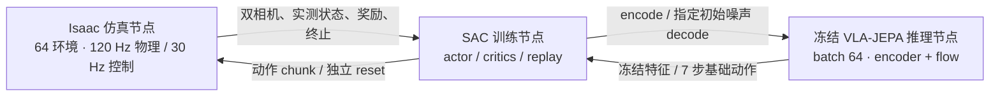

# PressB — PiPER 电梯按键与 VLA 在线残差强化学习

**进展更新：2026-10-09。** 已完成 Isaac 并行仿真、冻结 VLA-JEPA 推理与 SAC 训练的三节点框架，两种方法各 1M 在线训练，以及固定噪声策略后从头训练动作残差的多轮 400k 实验。最新 XYZ-only 残差的单次固定条件评估为 **119/120（99.17%）**；额外动作平滑仍为实验选项，未默认启用。

[当前结果](#当前结果) · [演示视频](#演示视频) · [三节点框架](#在线强化学习独立三节点) · [运行说明](docs/online_rl_fast.md) · [工作交接](docs/HANDOVER.md)

当前 RTX 5090 环境使用 **Isaac Sim 5.0 / Isaac Lab 2.2 / Python 3.11**。项目包含轨迹规划、真实接触反馈、双相机采集、LeRobot 导出、动作回放、VLA 闭环评估和在线残差强化学习；保留原 Isaac Sim 4.5 / Isaac Lab 2.0.2 环境的历史脚本与说明。

- 黑色 PiPER 放在桌沿，夹爪保持 8 mm 总开度夹持按压杆；初始姿态为大臂、小臂在桌面上方折叠。
- 墙上面板为 2 列 × 6 行：左列从下到上 24–29，右列 30–35。按钮受接触力推动，边缘橙灯在按下时亮、回弹后灭。
- 腕部与桌面各一台 D435；腕部复用 AgileX 官方支架网格，双路 RGB 默认 640×480。
- 采集支持面板左右 ±25 mm、前后 ±10 mm 变化；10×10 分层覆盖，每层 100 条，共 1,200 条 episode。
- 训练数据只保留折叠初始姿态到首次成功亮灯的前缀。撤回、归位用于下一次采集，保留在原始诊断记录中。

仓库包含代码、配置、资产来源清单、结果摘要和精选演示。**完整数据集、模型权重、下载素材、Conda 环境和原始运行录像不存入 Git**；仅 [docs/media](docs/media/README.md) 中的压缩演示随仓库发布。详细场景与历史验证记录见 [scene_details.md](docs/scene_details.md)。

## 当前结果

原始 VLA-JEPA 以 1,200 条带面板位置变化的专家 episode 微调，使用固定的 **step 10600** checkpoint。在线阶段始终冻结 VLA；先分别学习动作输出残差和 flow 初始噪声，再固定已训练的噪声策略，从随机初始化重新训练动作残差。噪声方法直接选择 flow 的初始噪声，不反向更新 VLA。

下表为同一 fast 仿真约定下的 **12 按键 × 5 个面板位置（中心、四角）× 2 次，共 120 次**固定条件评估，seed=20260930。记录的是真实按钮接触任务成功率，评估不更新参数。表中的 400k 是新增动作残差的训练预算，之前的 1M 噪声训练另计；多次运行不保证逐位相同，也不能把单次结果解释为多种子泛化保证。

| 方法 | 在线训练 | 成功次数 | 成功率 |
|---|---|---:|---:|
| 原始 VLA-JEPA | 无 RL | 25/120 | 20.83% |
| 独立动作残差 | 1M | 81/120 | 67.50% |
| 独立初始噪声策略 | 1M | 81/120 | 67.50% |
| 叠加两份独立训练的策略 | 两份 1M 权重，无联合重训 | 96/120 | 80.00% |
| 固定噪声，重训 9D 残差，γ=0.99 | 400k | 114/120 | 95.00% |
| 固定噪声，重训 9D 残差，γ=0.995 | 400k | 118/120 | 98.33% |
| 上一设置的残差 scale 减半 | 400k | 87/120 | 72.50% |
| **固定噪声，重训 XYZ 残差，γ=0.995** | **400k** | **119/120** | **99.17%** |

最新 XYZ actor 只输出 **7×3=21 维**残差，位置 scale 为 **[0.02, 0.02, 0.02] m**，旋转和夹爪沿用冻结模型输出。400k 训练约 **7 小时 25 分钟**，完成 398k 次 SAC 更新；24 键为 9/10，25–35 键均为 10/10。对照的完整 9D scale 是 XYZ 各 0.03 m、rotation6D 各 0.1；半 scale 为 XYZ 各 0.015 m、rotation6D 各 0.05。折扣 γ 以每个 30 Hz 控制步计算，7 步 chunk 为 `γ**7`。

**平滑实验（已完成 1,320 次评估）：** XYZ 指数平滑 α=0.8 可使共同成功任务中的实际关节 jerk 中位数下降约 14%、末端位置 jerk 下降约 30%，任务时长增加约 0.7%–2.7%。筛选为 119/120（同期基线 117），独立种子复核为 117/120（基线 116）。位置＋姿态平滑和更轻的 α=0.9 也未通过全部预设成功率门槛，因此默认保持 **无新增后处理**，不将平滑候选的最佳筛选成绩当作稳定结论。

可下载的 [结果与逐按键统计](docs/results/online_rl_20261009.json)、[结果表 CSV](docs/results/online_rl_20261009.csv) 保留原日志来源与 SHA-256；[平滑汇总](docs/results/smoothing_20261009.csv) 包含所有候选。复现、冻结检查和各实验配置见 [固定噪声后的残差训练](docs/residual_on_frozen_noise.md)。

## 演示视频

点击预览图播放或下载 MP4。三段都覆盖全部 12 个按键的中心布局，保持 **1× 仿真时间**，上下分别为全局与腕部视角；任务结束后显示明确标记的终止停帧。演示样本与上表包含面板偏移的 120 次评估不同。

| 原始 VLA → 固定噪声＋9D 残差 | 9D 残差 → XYZ-only 残差 | XYZ 平滑实验（未采用） |
|---|---|---|
| [](https://github.com/pgq18/PressB/raw/refs/heads/main/docs/media/before-vs-residual.mp4) | [](https://github.com/pgq18/PressB/raw/refs/heads/main/docs/media/pose9-vs-xyz.mp4) | [](https://github.com/pgq18/PressB/raw/refs/heads/main/docs/media/xyz-smoothing-experimental.mp4) |
| 左 4/12，右 12/12；右侧 γ=0.995、400k | 左 12/12，右 11/12；XYZ 演示有一次 24→25 | 左、右均 12/12；完整同期评估为 116/120 与 117/120 |

原视频来源、压缩参数、实际帧数和审核记录见 [媒体说明](docs/media/README.md)。视频平滑度依据实测轨迹回放，未通过播放加速或插帧制造差异。

## 仓库分工与复现范围

| 仓库 | 职责 | 本地位置 |
|---|---|---|
| [PressB](https://github.com/pgq18/PressB) | Isaac 场景、三节点服务、SAC 适配、实验、评估与视频审计 | 本仓库；RL 实现在 `src/pressb/online_rl/` |
| [VLA-JEPA](https://github.com/pgq18/VLA-JEPA/tree/base) | 视觉／状态／语言编码与 flow-matching 模型、PiPER 微调和推理 | 独立仓库 `src/VLA-JEPA/` |
| [ZPRL-PressB](https://github.com/pgq18/ZPRL-PressB) | 残差 SAC、初始噪声方法及采样调度的参考实现 | 可选独立仓库 `src/ZPRL/`，运行 PressB 不需要导入它 |

两个子目录是独立 Git 仓库，不打包进 PressB，也不是隐式 submodule。版本和用途记录在 [仓库版本清单](repos.lock.json)。已训练 RL checkpoint 严格绑定推理来源；复现现有权重时，VLA-JEPA 的运行 checkout 保持 `9c9dc71c8e199c7428b25d103ab666395832c001`，不能因只更新文档就改为最新 HEAD：

```bash
git clone --branch base https://github.com/pgq18/VLA-JEPA.git src/VLA-JEPA
git -C src/VLA-JEPA checkout --detach 9c9dc71c8e199c7428b25d103ab666395832c001

# 可选：阅读原始 RL 方法。实际训练代码已在 PressB 内。
git clone https://github.com/pgq18/ZPRL-PressB.git src/ZPRL
```

干净克隆包含源码、精选媒体和统计摘要，**不包含** VLA／RL 权重、场景快照、采集元数据和模型缓存。通用三个节点可显式配置路径；`run_residual_on_noise_experiment.py`、平滑和视频实验 supervisor 则是本工作区的复现入口，依赖文档记录的既有 `outputs/` 资产及身份清单，不能在空目录直接启动。部署方式见 [高吞吐运行说明](docs/online_rl_fast.md) 和 [5090 环境](docs/rtx5090_setup.md)。

## 安装

**RTX 5090 工作站**：使用已验收的 Python 3.11 / Isaac Sim 5.0 / Isaac Lab 2.2 配置，安装入口为 scripts/setup_env_5090.sh；步骤和实测结果见 [RTX 5090 运行说明](docs/rtx5090_setup.md)。下面的 setup_env.sh 属于原 Python 3.10 配置。

需要 Linux x86_64、Conda、支持 Isaac Sim 的 NVIDIA RTX GPU/驱动与 Vulkan，以及系统 `git`、`ffmpeg`、`ffprobe`（FFmpeg 需包含 `libx264`）和 DejaVu 字体。无窗口运行仍需要 GPU 渲染。显存需求随并行环境数增加；先从一张卡、一个环境验证。

```bash
git clone https://github.com/pgq18/PressB.git
cd PressB

# Ubuntu / Debian 系统依赖，按机器已有安装情况执行
sudo apt-get install ffmpeg fonts-dejavu-core

# 当前 5090 Isaac 环境：Python 3.11，默认 .conda/envs/pressb
# 可用 CONDA_BIN=/path/to/conda 显式指定 Conda
bash scripts/setup_env_5090.sh

# 下载固定版本资产并核对 SHA-256；已有冲突文件不会被覆盖
.conda/envs/pressb/bin/python scripts/fetch_assets.py

# 使用隔离的 OpenUSD 24.11 原样提取官方支架与 D435 网格
PYTHONPATH=.cache/usd-inspect .conda/envs/pressb/bin/python scripts/prepare_wrist_asset.py

# LeRobot 转换环境：独立 Python 3.12 / CPU PyTorch
bash scripts/setup_dataset_env.sh
```

两个 Python 环境分开使用：仿真使用 `.conda/envs/pressb/bin/python`，LeRobot 转换与官方读取使用 `.conda/envs/lerobot/bin/python`。不要将 `requirements-dataset.txt` 安装到 Isaac 环境。安装脚本设置 `OMNI_KIT_ACCEPT_EULA=YES`；使用 NVIDIA 软件和素材需遵守其许可，来源见 [THIRD_PARTY.md](THIRD_PARTY.md)。

## 先生成场景并验证

```bash
# 12 个按钮依次按压；每次按完回到折叠初始位姿
bash scripts/run.sh --headless --gpu 0 --video --output outputs/edge_feedback

.conda/envs/pressb/bin/python scripts/audit_episode.py outputs/edge_feedback
.conda/envs/pressb/bin/python scripts/check_results.py outputs/edge_feedback
.conda/envs/pressb/bin/python scripts/audit_global_camera.py outputs/edge_feedback

# 需要显示器 / 远程桌面时
# bash scripts/run.sh --gpu 0 --hold --output outputs/gui
```

生成的 `outputs/edge_feedback/scene.usda` 和同目录 `wrist_camera/intrinsics.json`、`global_camera/intrinsics.json` 是后续采集的输入，干净克隆中尚不存在。`--gpu` 是 Isaac/Vulkan 设备编号，请选择有可用显存的设备。演示默认 10 Hz 图像、120 Hz 物理；批量采集通过 `--fps` 独立指定采样频率。

## 采集 12 × 100 条位置分层数据

```bash
# --gpus 0 表示一张卡；也可指定 0,1 等多个设备
.conda/envs/pressb/bin/python scripts/collect_parallel.py \
  --config configs/dataset_panel_stratified_1200.json \
  --snapshot outputs/edge_feedback/scene.usda \
  --output datasets/piper_elevator_raw_panel_stratified_30hz \
  --gpus 0 --num-envs 3 --fps 30 \
  --episodes-per-task 100 --seed 20260930

.conda/envs/pressb/bin/python scripts/audit_raw_dataset.py \
  datasets/piper_elevator_raw_panel_stratified_30hz --episodes-per-task 100

.conda/envs/pressb/bin/python scripts/audit_panel_coverage.py \
  datasets/piper_elevator_raw_panel_stratified_30hz \
  --report outputs/panel_stratified_1200/coverage.json
```

每层的 10×10 网格要求 `--episodes-per-task 100`，且采集 seed 必须与配置里的 `grid_seed` 一致。少量预检可用 `collect_dataset.sh --max-episodes 2`，仍保留这些配置参数并使用独立输出目录。每次换位后检查全局相机的完整面板投影、全部按钮可达性，以及实际按压、碰撞和归位记录。并行场景只保留一个有效 Dome 环境光。

采样频率须整除 120 Hz 物理频率，例如 10、20、30、60 Hz；更改频率须使用独立数据目录。下面的首次亮灯导出示例针对 30 Hz 数据。采集元信息与代码指纹阻止混用不同来源，不能通过改写元数据绕过续采检查。

## 导出首次亮灯前缀为 LeRobot v3

```bash
PYTHONPATH=src .conda/envs/pressb/bin/python -m pressb.press_prefix \
  --raw datasets/piper_elevator_raw_panel_stratified_30hz \
  --output outputs/panel_stratified_1200/cut_plan.json \
  --episodes-per-floor 100

.conda/envs/lerobot/bin/python scripts/export_press_dataset.py \
  --raw datasets/piper_elevator_raw_panel_stratified_30hz \
  --cut-plan outputs/panel_stratified_1200/cut_plan.json \
  --output datasets/piper_elevator_lerobot_panel_stratified_press_30hz \
  --parts datasets/piper_elevator_parts_panel_stratified_press_30hz \
  --episodes-per-task 100 --part-size 25 --workers 4

.conda/envs/lerobot/bin/python scripts/confirm_press_dataset_reader.py \
  datasets/piper_elevator_lerobot_panel_stratified_press_30hz \
  --expected-episodes 1200 \
  --report outputs/panel_stratified_1200/readback.json
```

导出器对分片与最终数据执行数值、视频解码和首次亮灯终点检查；官方读取检查是额外验证。输出路径已存在时，遵循脚本的恢复/一致性检查或换用新目录，不要覆盖已验证的批次。

数据约定：

| 字段 | 含义 |
|---|---|
| task | `Press 24 floor.` … `Press 35 floor.` |
| state | 实际夹爪 TCP 位姿与实测夹爪开度 |
| action | 下一采样时刻的绝对 TCP 目标位姿与固定夹爪开度 |
| pose | `[x, y, z, qw, qx, qy, qz, gripper_width]`，基座 `base_link` 坐标系，米 |
| cameras | `observation.images.global`、`observation.images.wrist`，同步 RGB |
| metadata | 面板 XY 偏移、随机 seed、来源与采集指纹 |

夹爪 TCP 位于 `link6` 局部 Z=0.1358 m；按压杆尖端为 Z=0.24 m，两者不是同一个点。VLA-JEPA 训练适配将旋转转换为旋转矩阵前两行展开的 6D，XYZ 保持原值，固定夹爪开度不参与学习。训练及推理服务代码位于 [pgq18/VLA-JEPA](https://github.com/pgq18/VLA-JEPA/tree/base)。

## 回放与策略评估

- [录制动作回放](docs/replay.md)：从 LeRobot action 经 IK 执行并检查实际接触。
- [策略闭环评估](docs/policy_eval.md)：输入当前双相机、实测 TCP 与任务文本，执行模型返回的绝对目标。
- [动作平滑](docs/policy_smoothing.md)：120 Hz 关节插值之后默认使用 3 点因果均值滤波。

评估须显式指定与训练集一致的配置、场景快照、checkpoint step 和 SHA-256。`--panel-layouts center_corners` 覆盖训练配置的中心与四个边界角点。成功依据真实按钮行程、接触力和无误按/异常碰撞，不以接近按钮或 IK 成功代替；远端推理期间仿真暂停，因此本测试不衡量真实时间部署延迟。

旧采集机、旧控制器上的 step 10600 固定 60 条评估曾为 **5/60 成功、27 次误按、28 次超时**。这是旧环境诊断，不能与当前 fast 仿真的 25/120 基线混用；当前 RL 结果见本文开头。完整原始录像和报告保留在本地 `outputs/`，精选演示另见上方媒体。

## 在线强化学习：独立三节点

[在线 RL 运行说明](docs/online_rl.md) 提供仿真、冻结 VLA-JEPA 推理和 SAC 训练三个 HTTP 节点，可部署在三台不同机器。[高吞吐版本](docs/online_rl_fast.md) 增加独立 episode 重置、批量推理、采样与梯度更新重叠；支持本机 GPU 1 上共置仿真与推理、GPU 0 训练，也保留 H200 推理的跨节点配置。



当前训练采用 **64 环境、batch 64 推理**，不再等待整组 episode 全部结束后重置。一个 transition 是一个环境的最多 7 步动作 chunk，**不是一个 episode**。两个 1M 实验实测训练用时分别约 **19.81 h（动作残差）/ 15.16 h（初始噪声）**，均包括采样、梯度更新和保存；先前短窗口外推不是最终耗时。最新 XYZ 400k 用时约 7.43 h。视频显示仿真时间，不代表真实机械臂部署延迟。

支持两种来自 ZPRL 的方法：动作输出残差与初始 flow 噪声选择。当前配置为 `configs/online_rl_fast_action_residual.json` 和 `configs/online_rl_fast_initial_noise.json`；入口为 `scripts/serve_rl_fast_simulation.py`、`scripts/serve_rl_inference.py`、`scripts/run_fast_online_rl.py`。模型权重保持冻结，训练端独立保存 replay、actor/critics、optimizer 与恢复状态；评估使用固定中心/四角条件。原 `serve_rl_simulation.py` / `run_online_rl.py` 保留用于旧调度复现。精确通信与 transition 语义见 [协议](docs/online_rl_protocol.md)。

## 检查与目录

```bash
.conda/envs/pressb/bin/python scripts/fetch_assets.py --check-only
.conda/envs/pressb/bin/python -m pytest -q

# 可显式指定用于 USD 场景集成测试的快照
PRESSB_TEST_SNAPSHOT=outputs/edge_feedback/scene.usda \
  PYTHONPATH=.cache/usd-inspect:src \
  .conda/envs/pressb/bin/python -m pytest -q tests/test_dataset_scene.py

# 数据/视频审计测试在独立 LeRobot 环境运行
.conda/envs/lerobot/bin/python -m pip install pytest
.conda/envs/lerobot/bin/python -m pytest -q \
  tests/test_press_dataset_audit.py tests/test_press_export.py \
  tests/test_dataset_provenance.py tests/test_export_fps.py \
  tests/test_camera_timing.py tests/test_collection_timing.py \
  tests/test_feedback_panel_offsets.py tests/test_replay_audit.py \
  tests/test_panel_metadata.py tests/test_panel_coverage_audit.py
```

没有场景快照的克隆会跳过依赖快照的 USD 集成测试；显式指定不存在的快照会报错。素材依赖的运动学测试须在下载资产后运行。Isaac 环境不包含 PyAV 时，相应视频测试会明确跳过；上面的 LeRobot 环境命令补充执行这部分检查，避免把数据依赖装进 Isaac 环境。

| 目录 | 内容 |
|---|---|
| `src/pressb/` | 场景、机器人运动学、规划、相机、数据语义与策略控制 |
| `src/pressb/online_rl/` | 三节点协议、批量仿真／推理、SAC、冻结策略组合与平滑评估 |
| `scripts/` | 安装、资产准备、采集、转换、回放、评估和审计入口 |
| `configs/` | 固定场景、随机位置和 1,200 条分层采集配置 |
| `tests/` | CPU 单元测试与可选 USD 场景集成测试 |
| `assets/*.json` | 固定资产来源、校验和与安装配准元数据 |
| `docs/` | 当前流程说明及注明范围的历史实验记录 |
| `docs/results/`, `docs/media/` | 随仓库发布的小型结果摘要和精选压缩视频 |
| `src/VLA-JEPA/`, `src/ZPRL/` | 单独克隆与发布的依赖／参考仓库（本仓库忽略） |
| `vendor/`, `assets/generated/`, `assets/isaac/` | 本地下载或生成的依赖与素材（忽略） |
| `datasets/`, `outputs/`, `logs/`, `.conda/`, `.cache/` | 本地数据、结果、环境与缓存（忽略） |

更多说明：[30 Hz 数据](docs/dataset_30hz.md) · [首次亮灯裁剪](docs/dataset_press_only.md) · [位置随机化](docs/dataset_panel_randomization.md) · [分层覆盖记录](docs/dataset_panel_stratified.md)。
