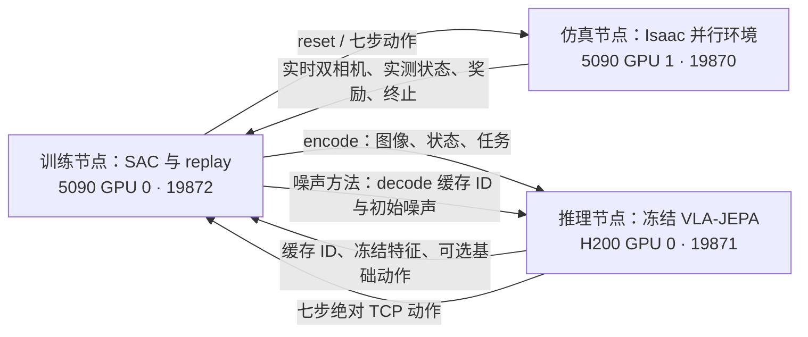

# VLA-JEPA 在线残差强化学习

PressB 提供三个独立 HTTP 节点。仿真端只运行 Isaac，推理端只运行冻结 VLA-JEPA，训练端只训练 SAC actor、critics 与温度参数。三者可以分别放在三台机器。本文记录早期跨节点版本：仿真位于 5090 GPU 1、训练位于 GPU 0，冻结推理位于 H200 GPU 0。

当前高吞吐入口见 [online_rl_fast.md](online_rl_fast.md)：64 环境独立 episode 重置、批量控制与推理、SAC 更新和网络等待重叠；训练在本机 GPU 0，仿真和冻结推理共用 GPU 1。本文原命令保留为旧控制器与图像约定的复现实例；下文“整组重置”的限制仅适用于 `run_online_rl.py` / `serve_rl_simulation.py`。截至 2026-10-09 的训练和评估结论见 [主 README](../README.md#当前结果)。



## 两种方法

以本地 `src/ZPRL` 的 `a34a1cb` 为算法来源，适配代码保留 MIT notice。没有安装 Robomimic/MuJoCo，也不需要用 ZPRL 的旧 Conda 文件重建 Isaac 环境。

| 项目 | action_residual | initial_noise |
|---|---|---|
| RL action | 7×9 个有界残差 | 默认 1×9 个有界噪声值 |
| 组合 | `base_pose9 + scale9 * u` | `initial_noise = 1.5 * repeat(u, 7)` |
| 位置/旋转尺度 | XYZ 默认 0.03 m；rotation6D 各分量 0.1 | 初始 flow 噪声为无量纲 |
| actor 输入 | 冻结特征、实测状态、控制历史、task one-hot、基础动作 | 同左但不输入基础动作 |
| critics | 2 个有界 [0,1] Q，评价组合后的 pose9 | 5 个无界 Q，评价归一化噪声 |
| target | 随机 Q 子集取最小，无 entropy 项 | 随机 Q 子集取最小，加 entropy 项 |
| actor Q 聚合 | 全部 Q 均值 | 全部 Q 最小值 |
| warmup | 零残差，执行基础模型 | 截断标准高斯，存下实际执行的归一化噪声 |
| eval actor | 确定性均值 | 默认采样，与本地 ZPRL 一致；可显式选择确定性 |

噪声方法直接**选择初始噪声**，不是在高斯噪声上加残差。零噪声不等于基础模型；对照必须使用 `--method base` 的原始高斯采样。VLA-JEPA 的完整 horizon=7，因此 noise_steps 只允许 1 或 7，不沿用 ZPRL 的 2。CAPS 是可选扩展，两个 lambda 默认 null；设置两个非负权重即可启用 residual 平滑项。

冻结模型输出的全部 32 个 embodied action token 仍进入原 flow。训练端只接收其 2048 维平均特征，再拼接实测 pose9、关节/速度/IK/滤波历史、剩余时间信息及任务 one-hot。按键坐标和面板偏移只用于场景设置、物理奖励与记录，不提供给 actor/critic。原模型参数全部 requires_grad=False，没有反传穿过远端模型。

## 运行

所有命令从 PressB 项目根运行。已有 5090 `.conda/envs/pressb` 和 H200 `vlajepa-piper` 环境可用。训练端仅需要 PyTorch、NumPy、SciPy、Pillow 与本仓库；第三台机器可安装 `pip install -e '.[online-rl]'`，并单独选择适合该 GPU 的 PyTorch 构建。不要改变现有 Isaac 环境中的 Torch/CUDA 组合。

启动前查看两台机器当前 GPU 占用。下面的输出目录必须不存在。

1. 5090：启动仿真端（默认使用现有冻结场景、配置与资产包）：

```bash
env -u PYTHONPATH OMNI_KIT_ACCEPT_EULA=YES \
  .conda/envs/pressb/bin/python scripts/serve_rl_simulation.py \
  --gpu 1 --port 19870 --num-envs 3 --max-seconds 15 \
  --output outputs/online_rl/simulation_new
```

若换机器，显式提供 `--config --snapshot --dataset --asset-bundle`。dataset 只需含 `meta/collection_metadata.json`；训练不读取专家 episode。场景原 SHA 与 collection fingerprint 必须匹配，资产重定位生成独立 runtime scene。

2. 5090：同步推理 addon（保持 H200 原训练仓库不变）：

```bash
.conda/envs/pressb/bin/python scripts/sync_rl_inference.py
```

3. H200：启动冻结推理端，保留该进程所在终端：

```bash
HF_HUB_OFFLINE=1 TRANSFORMERS_OFFLINE=1 \
  /home/pengguanqi/miniconda3/envs/vlajepa-piper/bin/python \
  /home/pengguanqi/Worksapce/Research/PressB-online-rl-20261002/scripts/serve_rl_inference.py \
  --vla-repo /home/pengguanqi/Worksapce/Research/VLA-JEPA \
  --checkpoint /data/scratch/pengguanqi/VLA-JEPA-runs/piper_panel_stratified_press30hz_pose9_3epochs_20260929/checkpoints/step_010600 \
  --device cuda:0 --port 19871
```

4. 5090：已有 SSH 主连接时添加转发；已存在的端口转发不重复添加：

```bash
ssh -S /tmp/pressb-5090-h200-eval.sock -o ConnectTimeout=120 \
  -O forward -L 127.0.0.1:19871:127.0.0.1:19871 h200
curl --fail http://127.0.0.1:19871/health
curl --fail http://127.0.0.1:19870/health
```

5. 5090：训练端占用另一张 GPU，选择一种方法：

```bash
.conda/envs/pressb/bin/python scripts/run_online_rl.py \
  --config configs/online_rl_action_residual.json \
  --device cuda:0 --port 19872 \
  --simulation http://127.0.0.1:19870 --inference http://127.0.0.1:19871 \
  --output outputs/online_rl/residual_new

# 第二种方法使用独立运行目录；在第一轮结束后运行。
.conda/envs/pressb/bin/python scripts/run_online_rl.py \
  --config configs/online_rl_initial_noise.json \
  --device cuda:0 --port 19872 \
  --simulation http://127.0.0.1:19870 --inference http://127.0.0.1:19871 \
  --output outputs/online_rl/noise_new
```

跨三台机器时，只需改变训练端的两个 URL，或在训练机器转发对应端口。服务默认只监听 loopback；私有网络可用 `--host` 指定地址。三个进程可共享 `PRESSB_RL_TOKEN` 环境变量进行 Bearer 认证，HTTP 本身不加密，SSH 隧道提供加密传输。没有共享文件系统要求：权重只在推理端、仿真资产只在仿真端、replay 和 RL checkpoint 只在训练端。

## 采样、奖励与停止

每个 transition 对应最多 7 个 30 Hz 动作，物理仍为 120 Hz。每一动作经原受限全位姿 IK、4 个插值 tick 和跨 chunk 因果均值滤波执行。首次目标按下、误按或异常碰撞立即终止；15 秒上限单独标记 truncated。仿真节点验证全部动作后才推进，网络重发带相同请求 ID 时不会再次执行物理。

奖励仅来自真实成功：目标按钮行程 ≥1.5 mm 且杆接触力 >0.02 N，没有误按或异常碰撞。其他结果奖励为 0。返回 chunk 内折扣奖励和基于实际 tick 数的 discount，提前结束不会误按完整七步计算。默认把 15 秒视为有限任务终点，不对超时 bootstrap；需要连续任务解释时可显式设置 `bootstrap_truncated=true`，仍只使用真实末状态。

所有并行环境共享一个 World。为避免一个环境重置的稳定步骤推进其它活动轨迹，采用整组重置：终止环境保存末观测，等同组全部结束后才重置。训练达到 max_transitions 或接收停止请求后会完成当前组，故可能超过阈值一组。网络等待、推理和 learner 更新期间物理时钟暂停。

`--num-envs` 是可调整的启动参数，3 仅为初始验证配置。改变并行数应先完成当前组并保存 checkpoint，再以新的仿真进程和训练输出目录恢复；replay、优化器和累计计数会继续保留。当前60条固定条件评估要求环境数能整除60，例如6或12。

整组结束后重置并非 Isaac 或 SAC 的要求，而是当前协议的实现方式：重置调用会推进共享 World 90个物理tick（0.75秒）以稳定机器人和按钮。直接删除整组检查会使其他活动轨迹发生未记录的推进。独立重置需要引入每环境的终止/稳定中/待动作状态、动作块与子步缓存，并让90tick稳定过程与其他环境的已下发动作共同推进；稳定阶段本身不生成学习transition。当前版本尚未实现这一独立重置状态机。

```bash
curl --fail http://127.0.0.1:19872/status
curl --fail -H 'Content-Type: application/json' -d '{}' http://127.0.0.1:19872/stop
```

训练完成后释放仿真会话，两种方法可顺序复用同一仿真/推理服务。并发训练应使用独立仿真服务与端口，不能共享一个活动会话。推理 context 有上限和 600 秒 TTL；大规模 UTD 更新若超过 TTL，应明确增大 `--cache-ttl`。

## 评估与恢复

评估不更新网络，固定遍历 12 层×中心/四角；每条件一次为60条，多轮可将 `--eval-episodes` 设为120等。数量须可被 num_envs 整除。配对推理 seed 按 episode 条件与 chunk 编号生成，不受其它环境提前结束影响。

```bash
# 基础模型对照
.conda/envs/pressb/bin/python scripts/run_online_rl.py \
  --config configs/online_rl_action_residual.json --mode eval --method base \
  --eval-episodes 60 --seed 20260930 \
  --output outputs/online_rl/eval_base_new

# 学到的 residual
.conda/envs/pressb/bin/python scripts/run_online_rl.py \
  --config configs/online_rl_action_residual.json --mode eval \
  --checkpoint outputs/online_rl/residual_new/last.pt \
  --eval-episodes 60 --seed 20260930 \
  --output outputs/online_rl/eval_residual_new

# 同配置恢复训练，保存到新目录
.conda/envs/pressb/bin/python scripts/run_online_rl.py \
  --config configs/online_rl_action_residual.json --resume \
  --checkpoint outputs/online_rl/residual_new/last.pt --max-transitions 200000 \
  --output outputs/online_rl/residual_resumed_new
```

checkpoint 保存 actor、Q/target Q、温度、各 optimizer、RNG、replay、训练计数和两端身份。恢复会重新开始一组物理 episode，不宣称恢复同一个 PhysX 状态；若上次因故障留有活动会话，须先重启该仿真服务并使用新输出目录。修改了模型、场景、时间限制、控制约定或 observation 维度的 checkpoint 不可混用。

训练目录包含 `manifest.json`、`metrics.jsonl`、`episodes.jsonl`、`status.json`、`summary.json`、`last.pt` 和阶段 checkpoint。仿真目录保存场景身份、每组重置证据、执行动作/IK诊断/接触事件；默认不保存训练全程视频。计数分别报告 transitions、physical_ticks、control_steps、updates 和 episodes。训练采样成功率与冻结条件评估成功率必须分开解读。

端口协议及精确字段见 [online_rl_protocol.md](online_rl_protocol.md)。短联调只证明三节点与梯度更新能够运行；是否提高成功率需要完成训练并做同条件评估。

## 本次实测范围（2026-10-02）

证据汇总保存在 `outputs/online_rl_integration_20261002/verification.json`，实验产物不进入 Git。

- 最终完整回归：579项测试全部通过（33.85秒），日志为 `outputs/online_rl_integration_20261002/pytest_full_final.log`。
- H200 step10600：新接口与原 PiperPolicy 的 pose9/pose8 逐值一致，最大差为0；显式同噪声与原 flow 一致，改变初始噪声会改变动作，缓存 decode 不再次执行 Qwen，模型可训练参数为0。
- 两种方法分别运行2个真实 Isaac 环境，各采集6条 transition并在另一张5090更新6次，actor/critic参数均发生变化，checkpoint包含真实replay。
- Noise checkpoint完成冻结评估（0次更新）；residual恢复后累计12条transition、12次更新，replay和计数连续。
- 训练联调用每条0.5秒的短episode，没有产生按键成功，不能据此评价学习效果。这些checkpoint仅用于验证链路，不用于正式策略比较。
- 另用两条已验收录制动作验证正奖励路径：24/25层分别在8.141667/8.175秒真实按亮后终止，无异常碰撞；最后动作块仅执行25/1个物理tick，奖励与实际时长折扣正确，先终止环境的末观测保持不变。这是动作回放诊断，不是模型成功率。
- 临时服务均已停止；H200原VLA-JEPA仓库与本地ZPRL仓库未修改，独立addon、运行报告和RL checkpoint保留。

## 长程训练的并行度调整（2026-10-02）

原3环境长程任务在5,291条transition、3,001次更新时受控保存 `last.pt`。随后使用冻结基础策略，对相同12个中心条件、相同逐episode/chunk种子测试3/6/12环境：

| 环境数 | 耗时（秒） | transition/s | 活跃环境时隙利用率 | 采样显存峰值（MiB） |
|---:|---:|---:|---:|---:|
| 3 | 326.18 | 1.401 | 72.40% | 4748 |
| 6 | 298.75 | 1.567 | 60.33% | 5119 |
| 12 | 270.38 | 1.661 | 57.59% | 5774 |

选择12环境续训，短基准吞吐较3环境提高18.5%。测试不包含梯度更新与服务启动，且每种配置仅12个episode，不能据此断言长期稳定提升比例或比较成功率。任务与噪声种子配对，但改变环境布局索引和渲染tile数量后轨迹并非逐值一致。

证据在 `outputs/online_rl_parallel_benchmark_20261002/comparison.json`；旧训练与checkpoint保存在 `outputs/online_rl_long_20261002_205454/`；续训目录为 `outputs/online_rl_long_20261002_parallel/`，服务 `pressb-rl-long-20261002-parallel`。两方法各100,000条的目标保持不变，动作残差恢复已有计数，初始噪声之后从头训练。当前仍使用整组重置；12环境约42.4%的环境时隙在终止后等待，独立重置是后续明确的吞吐改进方向。
